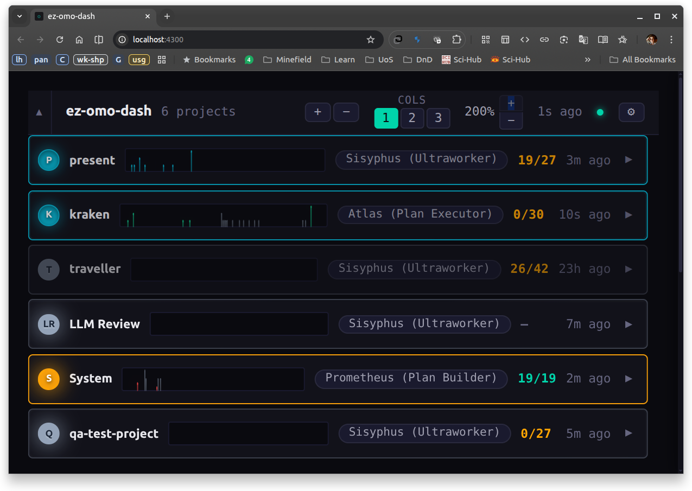
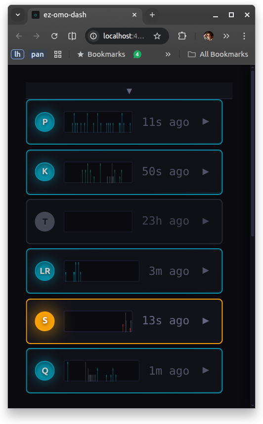
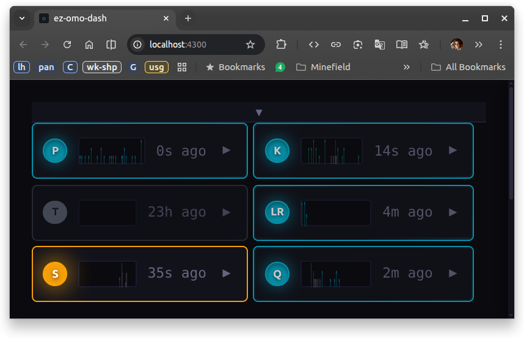
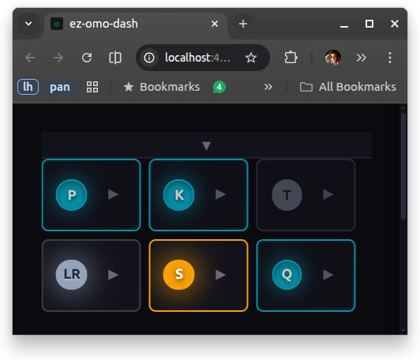

# omo-pulse

**Real-time dashboard for monitoring [oh-my-opencode](https://github.com/sst/opencode) AI coding sessions across all your projects.**

[](LICENSE)
[](https://bun.sh)
[](https://www.typescriptlang.org/)



## What is omo-pulse?

omo-pulse monitors multiple [oh-my-opencode](https://github.com/sst/opencode) projects in real-time, showing session activity, agent status, tool usage, plan progress, and token consumption in a single dashboard. It reads directly from oh-my-opencode's SQLite database — no configuration, no instrumentation, no hassle.

Run it as a persistent service alongside your development workflow and always know what your AI minions are up to (and when they require your attention).

## Features

### Functionality — What You Can Monitor

- **Multi-project dashboard** — keep an eye on all your oh-my-opencode projects in one window
- **Real-time polling** — auto-refreshing with connection health indicator (because stale data is sad data)
- **Plan progress** — so you know if your agent is 10% done or "almost there, just one more thing"
- **Background tasks** — active agents, models (Claude, GPT, Kimi), and running tools at a glance
- **Token consumption** per project: watch your budget melt in real-time
- **Session swimlane** — per-session activity timeline across all projects
- **Activity sparklines** — time-series charts for spotting patterns faster than your agent can hallucinate
- **Sound notifications** — audio alerts for idle, plan complete, errors, and questions (now you can pretend to work while your AI does)
- **Uncommitted changes tracker** — per-project git badge shows unsaved work at a glance, so you notice before an agent wipes it
- **Zero instrumentation** — reads oh-my-opencode's native SQLite database directly
- **Systemd service** *(optional)* — persistent background service with auto-start on login

### Interface — How You Monitor It

- **Multi-column layouts** — 1, 2, or 3-column grid to match your screen (and your multitasking ambitions)
- **Collapsible panes** — expand for full session details or collapse for quick status checks
- **Drag-and-drop ordering** — organize projects in your preferred order
- **Zoom controls** — scale the entire UI without screwing up your other browser windows
- **Color-coded states** — cyan (active), orange (needs attention), gray (idle) — identify what needs your attention at a glance
- **Per-project visibility** — show/hide individual projects from settings
- **Resizable columns** — drag handles to adjust column widths
- **Dark mode** — because light mode is for people who don't code at 2 AM

<table>
  <tr>
    <td></td>
    <td></td>
    <td></td>
  </tr>
  <tr>
    <td align="center"><em>Full detail</em></td>
    <td align="center"><em>Two columns</em></td>
    <td align="center"><em>Ultra-compact</em></td>
  </tr>
</table>

## Sound Notifications

Hear when your agents need attention. Custom synthesized sounds — no generic notification bleeps here:

| Event | Sound | Description |
|-------|-------|-------------|
| Session idle | <audio controls src="docs/sounds/idle.wav"></audio> | Soft double-tap — agent finished, waiting for you |
| Plan complete | <audio controls src="docs/sounds/plan-complete.wav"></audio> | Ascending arpeggio — victory fanfare (sort of) |
| Error/Attention | <audio controls src="docs/sounds/error.wav"></audio> | Dramatic sweep — something went sideways |
| Question pending | <audio controls src="docs/sounds/question.wav"></audio> | Rising "whaaa?" — agent needs your input |

All sounds are synthesized in real-time using the Web Audio API (no external files needed). Adjust volume per-event in settings.

## Quick Start

**Prerequisites:** [Bun](https://bun.sh) >= 1.1.0

```bash
git clone https://github.com/ezotoff/omo-pulse.git
cd omo-pulse
bun install
bun run dev
```

Open **http://localhost:4300** in your browser.

## What It Reads

omo-pulse is a **read-only observer** — it never writes to oh-my-opencode's data.

| Source | Path | Notes |
|---|---|---|
| **SQLite** (primary) | `~/.local/share/opencode/opencode.db` | Sessions, messages, tool parts |
| WAL side files | `opencode.db-wal`, `opencode.db-shm` | If present; polling catches updates within ~2s |
| **File-based** (fallback) | `~/.local/share/opencode/storage/{session,message,part}` | Legacy format, auto-detected |
| Plan progress | `.sisyphus/boulder.json` + plan markdown | oh-my-opencode plan tracking |
| Git status | `git status --porcelain` per project root | Cached 30s, 5s timeout |

Storage backend is auto-detected. No configuration needed.

## Installation (for AI Agents)

If you're an AI agent instructed to install and run omo-pulse for your user:

1. **Check for Bun** — verify Bun is installed (`bun --version`). If not, install it:
   ```bash
   curl -fsSL https://bun.sh/install | bash
   ```
   Then source the shell or restart terminal.

2. **Clone and install:**
   ```bash
   git clone https://github.com/ezotoff/omo-pulse.git
   cd omo-pulse
   bun install
   ```

3. **Run in development mode:**
   ```bash
   bun run dev
   ```

4. **Inform the user** to open **http://localhost:4300** in their browser.

**Production mode** (recommended for persistent use):
```bash
bun run build
bun run start
```

The dashboard will auto-detect oh-my-opencode projects from `~/.local/share/opencode/`. No additional configuration needed — just run it alongside your coding sessions.

## Configuration

| Variable | Default | Description |
|---|---|---|
| `OMO_PULSE_PORT` | `4300` | Vite dev server / production UI port |
| `OMO_PULSE_API_PORT` | `4301` | API server port (dev mode only) |
| `XDG_DATA_HOME` | `~/.local/share` | Base data directory for locating oh-my-opencode storage |

In development, the UI runs on port 4300 and proxies `/api` requests to the API server on port 4301. In production (`bun run start`), both are served from a single port (4300).

## Security

- **Localhost only** — binds to `127.0.0.1`, never exposed to network
- **Read-only** — never writes to oh-my-opencode's database
- **No sensitive data** — displays metadata only (agents, tools, tokens), never prompts or outputs

## Architecture

```
┌─────────────────────────────────────────────┐
│                  Browser                     │
│          React SPA (Vite + React 18)         │
│  ┌─────────┬──────────┬──────────────────┐   │
│  │ Project │ Sparkline│  Plan Progress   │   │
│  │ Strips  │ Charts   │  Session Swimlane│   │
│  └─────────┴──────────┴──────────────────┘   │
│              polling (~2s)                    │
└──────────────────┬──────────────────────────┘
                   │ GET /api/projects
┌──────────────────▼──────────────────────────┐
│            Hono API Server (Bun)             │
│  ┌──────────────────────────────────────┐    │
│  │  Multi-Project Service               │    │
│  │  ├─ per-source DashboardStore        │    │
│  │  ├─ session status derivation        │    │
│  │  ├─ plan progress (boulder/steps)    │    │
│  │  └─ time-series aggregation          │    │
│  └──────────────────────────────────────┘    │
│              reads from                      │
└──────────────────┬──────────────────────────┘
                   │
┌──────────────────▼──────────────────────────┐
│   oh-my-opencode SQLite DB (~/.local/share/ │
│     opencode/opencode.db)                   │
│   ─────────────────────────────             │
│   Fallback: file-based storage              │
│     (~/.local/share/opencode/storage/)      │
└──────────────────────────────────────────────┘
```

**Tech stack:** [Hono](https://hono.dev) (HTTP server) · [React 18](https://react.dev) (UI) · [Vite](https://vitejs.dev) (build) · [Bun SQLite](https://bun.sh/docs/api/sqlite) (data) · [@dnd-kit](https://dndkit.com) (drag-and-drop)

## Project Structure

```
src/
├── server/          # Hono API server
│   ├── api.ts       # REST endpoints (/health, /projects, /sources, /tool-calls)
│   ├── dashboard.ts # Per-project data derivation from oh-my-opencode storage
│   ├── multi-project.ts  # Multi-project aggregation service
│   ├── dev.ts       # Development server entry
│   └── start.ts     # Production server with SPA serving
├── ingest/          # Data ingestion and derivation
│   ├── storage-backend.ts  # SQLite / file-based backend selection
│   ├── session.ts          # Session metadata parsing
│   ├── boulder.ts          # Plan progress extraction
│   ├── timeseries.ts       # Activity time-series aggregation
│   ├── token-usage.ts      # Token consumption tracking
│   ├── tool-calls.ts       # Tool call derivation
│   └── background-tasks.ts # Background task tracking
├── ui/              # React SPA
│   ├── App.tsx      # Main dashboard layout with DnD
│   ├── components/  # ProjectStrip, Sparkline, PlanProgress, SessionSwimlane, etc.
│   └── hooks/       # useDashboardData, useProjectOrder, useSoundNotifications, etc.
└── types.ts         # Shared TypeScript types
```

## Scripts

| Script | Description |
|---|---|
| `bun run dev` | Start both dev servers (UI + API) |
| `bun run dev:ui` | Vite dev server only |
| `bun run dev:api` | API dev server only |
| `bun run build` | Production build |
| `bun run start` | Production server |
| `bun run test` | Run tests (Vitest) |

## Troubleshooting

| Issue | Solution |
|---|---|
| Dashboard shows empty | Ensure oh-my-opencode has run at least once in a project |
| Sessions not detected | Verify `XDG_DATA_HOME` points to correct location (default: `~/.local/share`) |
| Stale data in SQLite mode | OpenCode uses WAL; polling catches updates within ~2s |
| "Disconnected" in dev mode | Ensure API server is running (`bun run dev` starts both) |

## Contributing

See [CONTRIBUTING.md](CONTRIBUTING.md) for development setup, coding standards, and contribution guidelines.

## Acknowledgments

Inspired by [oh-my-opencode-dashboard](https://github.com/WilliamJudge94/oh-my-opencode-dashboard) by [@WilliamJudge94](https://github.com/WilliamJudge94) — the original oh-my-opencode monitoring dashboard that sparked the idea.

## License

[MIT](LICENSE)
