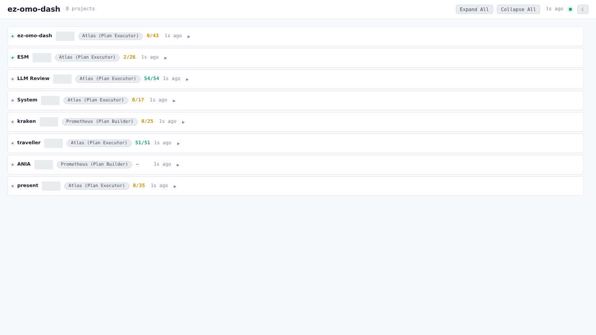

# omo-pulse

**Real-time dashboard for monitoring OpenCode AI coding sessions across all your projects.**

[](LICENSE)
[](https://bun.sh)
[](https://www.typescriptlang.org/)



## What is omo-pulse?

omo-pulse monitors multiple [OpenCode](https://github.com/sst/opencode) projects in real-time, showing session activity, agent status, tool usage, plan progress, and token consumption across all your AI coding sessions in a single dashboard. It reads directly from OpenCode's SQLite database — no configuration or instrumentation required.

Run it as a persistent service alongside your development workflow and always know what your AI agents are doing.

## Features

- **Multi-project dashboard** — monitor all registered OpenCode projects at a glance
- **Drag-and-drop reordering** — organize project strips in the order you prefer
- **Real-time polling** — auto-refreshing data every ~2 seconds with connection status indicator
- **Collapsible project strips** — expand for full session details or collapse for a compact overview
- **Plan progress tracking** — visualize Sisyphus plan completion with step-by-step breakdown
- **Session swimlane** — per-session activity timeline showing which sessions are active
- **Sparkline charts** — time-series activity graphs for each project
- **Background task tracking** — see active background agents, their models, and current tools
- **Token usage display** — input/output/total token consumption per project
- **Sound notifications** — configurable audio alerts for session idle, plan complete, errors, and questions
- **Multi-column layout** — adjustable column count with resizable column widths
- **Zoom controls** — scale the UI from 50% to 200%
- **Per-project visibility** — show/hide individual projects from the settings panel
- **Dark mode UI** — easy on the eyes during long coding sessions
- **SQLite storage** — reads OpenCode's native SQLite database with file-based fallback
- **Systemd service integration** — install as a user service for auto-start on login

## Quick Start

**Prerequisites:** [Bun](https://bun.sh) >= 1.1.0

```bash
git clone https://github.com/ezotoff/omo-pulse.git
cd omo-pulse
bun install
bun run dev
```

Open **http://localhost:4300** in your browser.

## Configuration

| Variable | Default | Description |
|---|---|---|
| `EZ_DASH_UI_PORT` | `4300` | Vite dev server / production UI port |
| `EZ_DASH_API_PORT` | `4301` | API server port (dev mode) |
| `XDG_DATA_HOME` | `~/.local/share` | Base data directory for locating OpenCode storage |

In development, the UI runs on port 4300 and proxies `/api` requests to the API server on port 4301. In production (`bun run start`), both are served from a single port (4300).

## Architecture

```
┌─────────────────────────────────────────────┐
│                  Browser                     │
│          React SPA (Vite + React 18)         │
│  ┌─────────┬──────────┬──────────────────┐   │
│  │ Project │ Sparkline│  Plan Progress   │   │
│  │ Strips  │ Charts   │  Session Swimlane│   │
│  └─────────┴──────────┴──────────────────┘   │
│              polling (~2s)                    │
└──────────────────┬──────────────────────────┘
                   │ GET /api/projects
┌──────────────────▼──────────────────────────┐
│            Hono API Server (Bun)             │
│  ┌──────────────────────────────────────┐    │
│  │  Multi-Project Service               │    │
│  │  ├─ per-source DashboardStore        │    │
│  │  ├─ session status derivation        │    │
│  │  ├─ plan progress (boulder/steps)    │    │
│  │  └─ time-series aggregation          │    │
│  └──────────────────────────────────────┘    │
│              reads from                      │
└──────────────────┬──────────────────────────┘
                   │
┌──────────────────▼──────────────────────────┐
│   OpenCode SQLite DB (~/.local/share/        │
│     opencode/opencode.db)                    │
│   ─────────────────────────────              │
│   Fallback: file-based storage               │
│     (~/.local/share/opencode/storage/)       │
└──────────────────────────────────────────────┘
```

**Tech stack:** [Hono](https://hono.dev) (HTTP server) · [React 18](https://react.dev) (UI) · [Vite](https://vitejs.dev) (build) · [Bun SQLite](https://bun.sh/docs/api/sqlite) (data) · [@dnd-kit](https://dndkit.com) (drag-and-drop)

## Project Structure

```
src/
├── server/          # Hono API server
│   ├── api.ts       # REST endpoints (/health, /projects, /sources, /tool-calls)
│   ├── dashboard.ts # Per-project data derivation from OpenCode storage
│   ├── multi-project.ts  # Multi-project aggregation service
│   ├── dev.ts       # Development server entry
│   └── start.ts     # Production server with SPA serving
├── ingest/          # Data ingestion and derivation
│   ├── storage-backend.ts  # SQLite / file-based backend selection
│   ├── session.ts          # Session metadata parsing
│   ├── boulder.ts          # Plan progress extraction
│   ├── timeseries.ts       # Activity time-series aggregation
│   ├── token-usage.ts      # Token consumption tracking
│   ├── tool-calls.ts       # Tool call derivation
│   └── background-tasks.ts # Background task tracking
├── ui/              # React SPA
│   ├── App.tsx      # Main dashboard layout with DnD
│   ├── components/  # ProjectStrip, Sparkline, PlanProgress, SessionSwimlane, etc.
│   └── hooks/       # useDashboardData, useProjectOrder, useSoundNotifications, etc.
└── types.ts         # Shared TypeScript types
```

## Scripts

| Script | Description |
|---|---|
| `bun run dev` | Start both dev servers (UI + API) |
| `bun run dev:ui` | Vite dev server only |
| `bun run dev:api` | API dev server only |
| `bun run build` | Production build |
| `bun run start` | Production server |
| `bun run test` | Run tests (Vitest) |

## Contributing

See [CONTRIBUTING.md](CONTRIBUTING.md) for development setup, coding standards, and contribution guidelines.

## License

[MIT](LICENSE) — Copyright 2025 EZotoff
